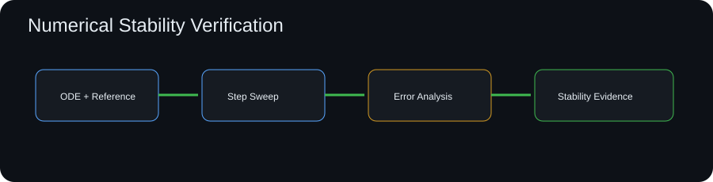

# Numerical Stability Test Harness

[](https://github.com/skytruong90/Numerical-Stability-Test-Harness/actions/workflows/ci.yml)


A numerical-method verification harness for simulation software. It compares explicit Euler and RK4 integration on a synthetic damped dynamic system across time-step sweeps, calculates error against an analytic reference, checks finite/bounded behavior, and produces stability/convergence evidence.



## Why this matters

A simulation can be logically correct and still be numerically unreliable. Step size, integration method, stiffness, and floating-point behavior can materially change a result. This project turns those concerns into repeatable automated tests.

## Capabilities

- Euler and fourth-order Runge-Kutta integrators
- analytic reference for a synthetic first-order decay model
- configurable time-step sweep
- absolute/relative terminal error
- observed convergence trend
- divergence and non-finite detection
- JSON evidence report and CI gate
- unit tests for integrator order/behavior

## Run it

```bash
git clone https://github.com/skytruong90/Numerical-Stability-Test-Harness.git
cd Numerical-Stability-Test-Harness
python -m venv .venv
# Linux/macOS: source .venv/bin/activate
# Windows PowerShell: .venv\Scripts\Activate.ps1
python -m pip install -e ".[dev]"
stability-test examples/sweep.json --output output/report.json
pytest
```

## What I learned / demonstrated

- numerical integration error should be characterized against a known reference before a method is trusted in a larger model
- reducing the time step is an engineering tradeoff, not a universal fix
- higher-order methods can provide much lower error at the same sample interval
- automated sweeps make convergence assumptions visible during code review
- finite/bounded checks catch catastrophic numerical failures before downstream analytics consume them

## Limitations

The included equation is intentionally simple so an exact solution exists. The harness demonstrates verification technique rather than the stability properties of a specific real vehicle model.
